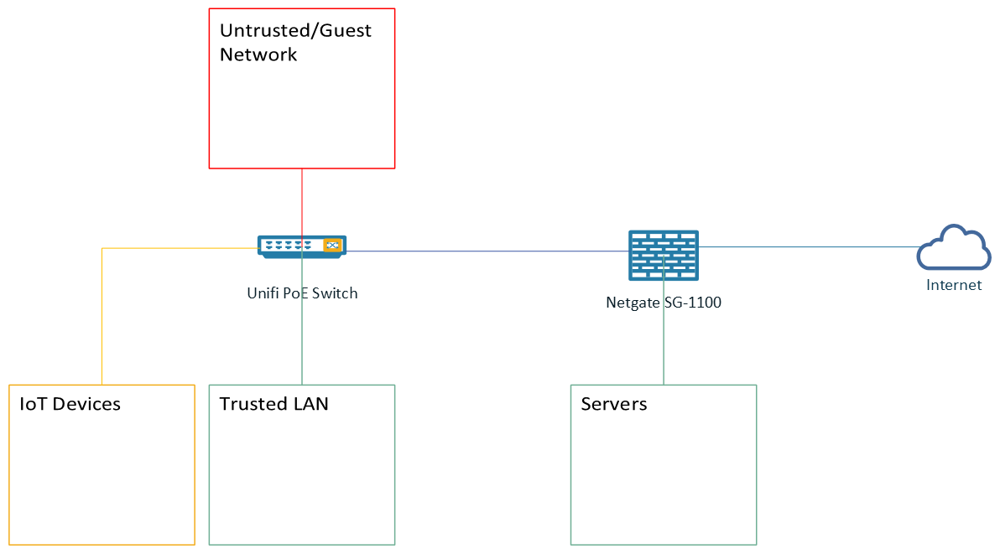
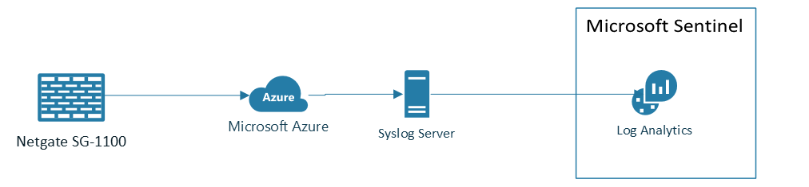
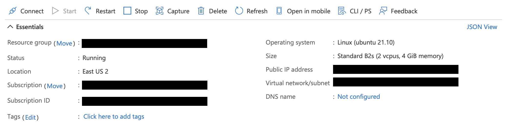
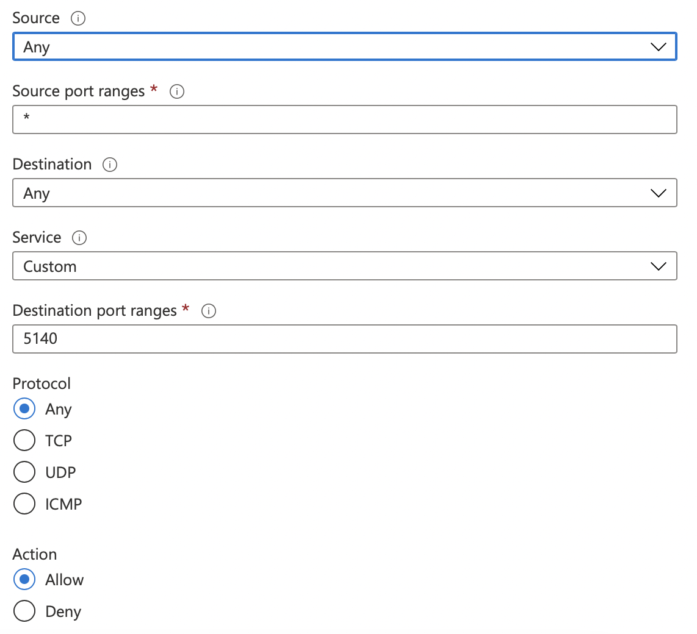
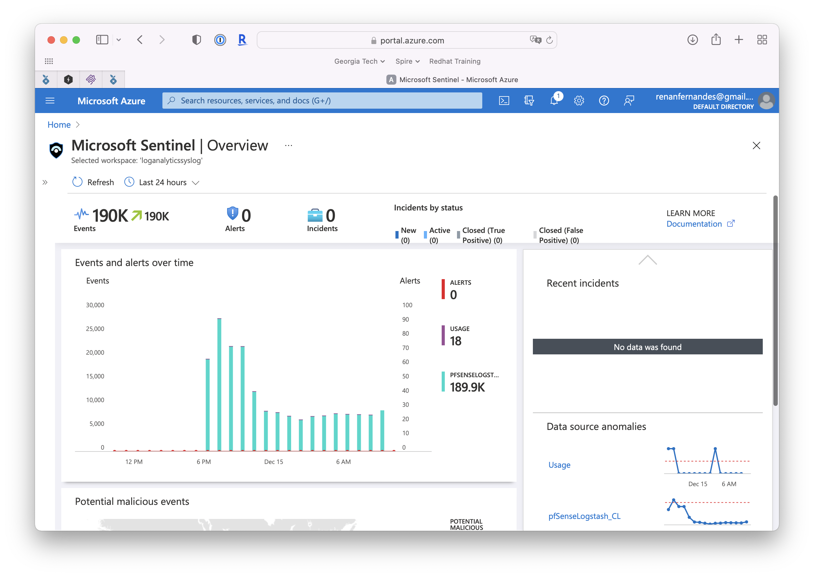
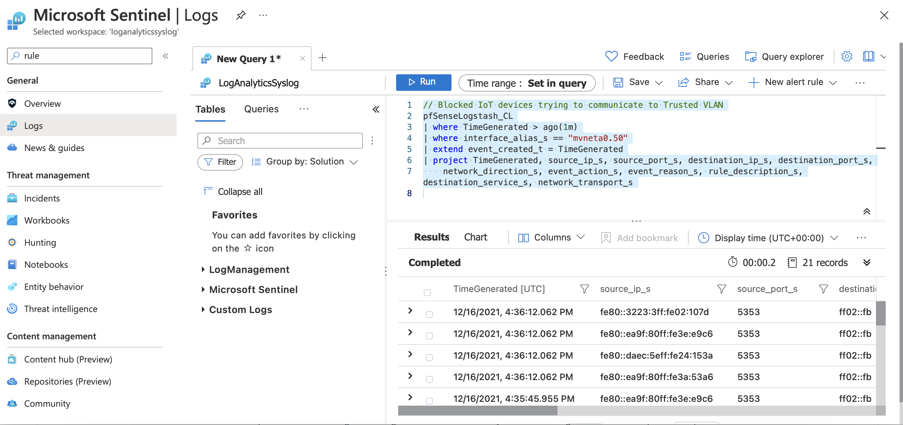
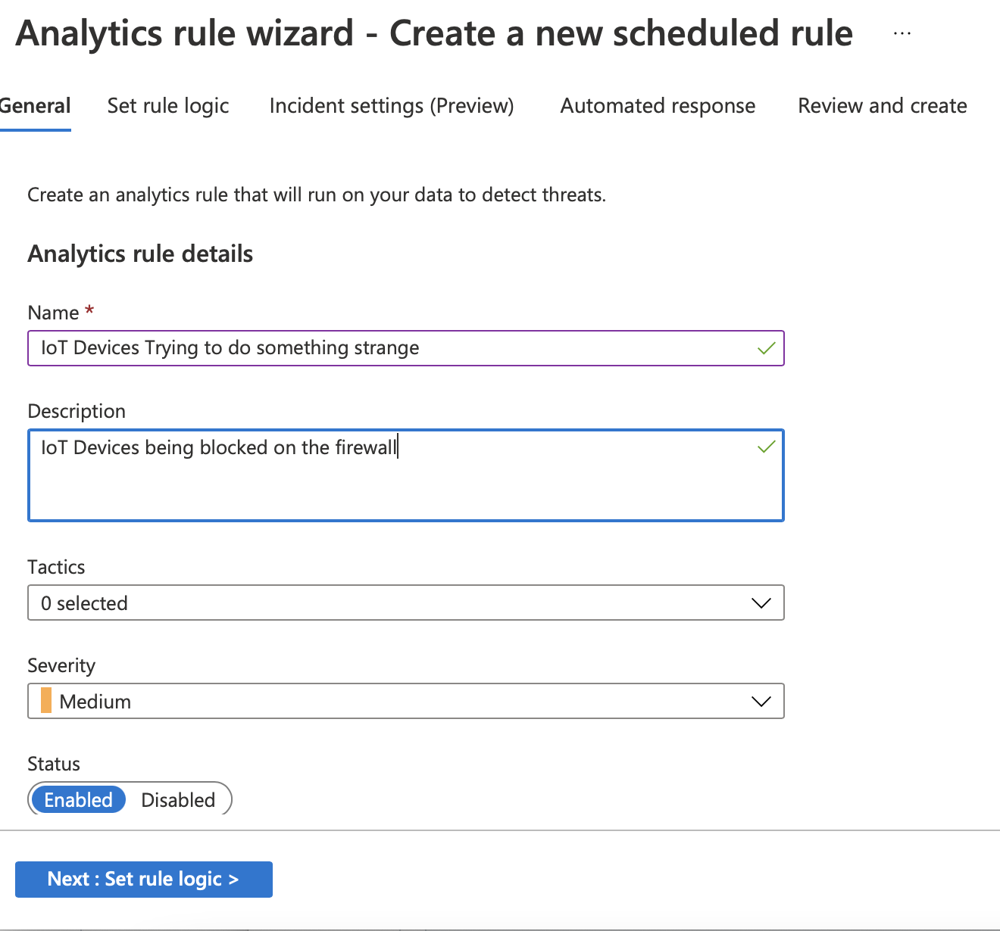
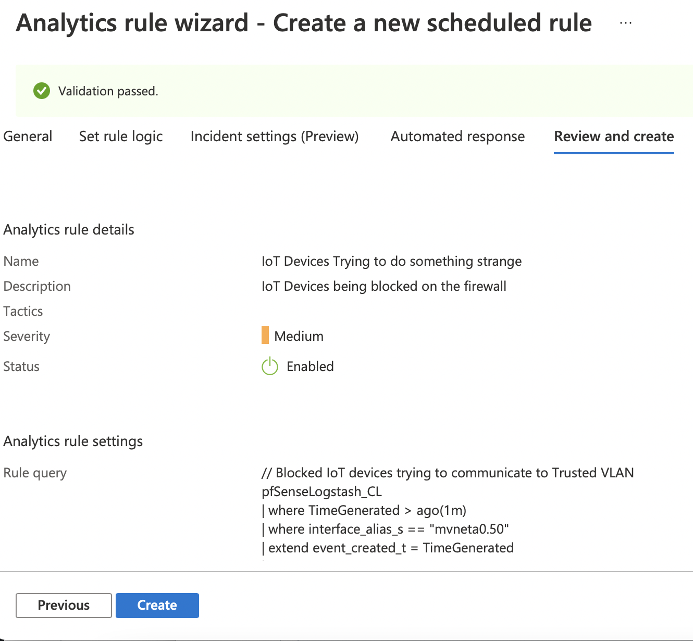

# Lab Stuff

Just a collection of templates, scripts, configuration files and testing observations to make my life easier. This is part of my own GitHub repository (and one of the fews I make public), so use the content and scripts here at your own risk :)

Table of Contents
=================

<!--ts-->
* [Integrating Sentinel and Home Infrastructure](#integrating-sentinel-and-home-infrastructure)
   * [Syslog server](#syslog-server)
     * [Provisioning the VM](#provisioning-the-vm)
     * [Configuring the Syslog Server](#configuring-the-syslog-server)
     * [Creating a Firewall rule to allow incoming traffic to Logstash](#creating-a-firewall-rule-to-allow-incoming-traffic-to-logstash)
   * [Configuring pfSense](#configuring-pfSense)
   * [Configuring Log Analytics Workspace](#configuring-log-analytics-workspace)
   * [Final Step: Sentinel!](#Final-Step-Sentinel)
     * [First Rule: Detecting lateral movement](#first-rule-detecting-lateral-movement)
* [macOS Stuff](#macOS-Stuff)
  * [Making terminal better](#making-terminal-better)

<!--te-->
# Integrating Sentinel and Home Infrastructure
As my home network continues to grow and more and more IoT devices are added, I felt the need to better improve my home security posture and frankly have a better visibilty over what is going on in my network.

To start, the diagram below shows how my home network is currently set up. Without going too much into details, I have three VLANs, 1) IoT, 2) Trusted Network, 3) Servers and 4) Untrusted/Guest Network.



My IoT VLAN goes out to the internet, but have no access to my Trusted VLAN, except for mdns broadcast that thanks to [Avahi](http://avahi.org), allows me to control my IoT devices when I am at home.
This is all ultimately controlled by pfSense running on my Netgate SG-1100. I am expanding the Network so after the holidays I'll replace SG-1100 for something a little bit more powerful.

So the idea is to start shipping my pfSense logs to [Microsoft Sentinel](https://azure.microsoft.com/en-us/services/azure-sentinel/), where I can better monitor my Network and detect suspicious activity. 

Microsoft Sentinel provides a Pay-As-You-Go [Pricing](https://azure.microsoft.com/en-us/pricing/details/azure-sentinel/) currently at $2.46 per GB ingested, that should keep the costs minimal for my home use and give me a lot of flexibility to create rules, orchestration and automation. So, no brainer :)

Ok, to put everything together, I created this draft to show what I will be deploying as my final solution:



I will be deploying a Syslog server on Azure, allowing me to scale the solution and forward syslog events from some key servers and applications I host locally.
My syslog data will be stored on Log Analytics Workspace that in the end will be added to Sentinel for Ingestion and Analysis.

So lets start!

*Disclaimer: This guide is merely a collection and notes of my experience doing this fun project. I used several resources and references to build this guide, such as: this amazing [Microsoft Tech Community Post](https://techcommunity.microsoft.com/t5/microsoft-sentinel/pfsense-syslog-to-azure-sentinel-guide/m-p/2004352) and this great [repository](https://github.com/noodlemctwoodle/pf-azure-sentinel/tree/main/Logstash-Configuration) maintained by noodlemctwoodle. I've updated the instructions below with the latest configurations and changes required.*

## Syslog server
First of all, we need a place to host our Syslog server. The way it works is that your Firewall (in my case my Netgate SG-1100) will send its logs to the Syslog server, that wil eventually relay the logs to Azure Sentinel.

You can run either a Windows or Linux server for your Syslog server and you can host on premise or in the cloud. Since my final goal is to ship the logs to Sentinel, I decided to create a Linux VM and host in Azure.

This will allow expansion in the future and permit me connecting my servers overseas to this infrascture all well (but thats a topic for another discussion)

### Provisioning the VM
Since I am not doing anything fancy and all I need is to collect syslogs, I provisioned a single VM with Ubuntu 21.10 and used **Standard_B2s** size. Which gives me 2 vCPUs and 4 GB of RAM at East US 2 Region. Costing me approximately $30.37/month, not bad!



Now that your VM is up, its time to configure Rsyslog Server

### Configuring the Syslog Server
First things first... Ensure you have the most up-to-date version of your packages and OS by running apt update:
```
sudo apt update
sudo apt upgrade
```


For consistency, lets ensure that your timeone is correct. In my case, America/New_York:
```
sudo timedatectl set-timezone America/New_York
```

**Announcement!!**
From now one, I'll rely on this amazing [Microsoft Tech Community Post](https://techcommunity.microsoft.com/t5/microsoft-sentinel/pfsense-syslog-to-azure-sentinel-guide/m-p/2004352) to configure and install elastic. You can follow the guide on the link or refer to my instructions below that provides some few changes to the config.

Ok, back to the instructions. First of all, we will need to install Logstash. For that, we need to first, Download and install the public GPG signing key:

```
wget -qO - https://artifacts.elastic.co/GPG-KEY-elasticsearch | sudo apt-key add -
```

Then, we need to install apt-transport-https to allow apt to access https repositories (in this case, Elastic)

```
sudo apt-get install apt-transport-https
```

Finally, we will add the Elastic Repositories

```
echo "deb https://artifacts.elastic.co/packages/7.x/apt stable main" | sudo tee -a /etc/apt/sources.list.d/elastic-7.x.list
```

*Note: ElasticSearch 6.8.9+ and 7.8.9+ are not vulnerable to [Apache Log4j2 CVE-2021-44228 vulnerability](https://discuss.elastic.co/t/apache-log4j2-remote-code-execution-rce-vulnerability-cve-2021-44228-esa-2021-31/291476), so please make sure you are installing the latest supported version*

Now lets update apt repository and install Logstash:

```
sudo apt update
sudo apt install logstash
```

If everything went well, Logstash will be installed shortly after. You can check the status of logstash by looking at the daemon status:

```
sudo service logstash status
```

Now lets configure Logstash and apply the grok pattern.

First, create the directories:

```
sudo mkdir /etc/logstash/conf.d/{databases,patterns,templates}
```

Second, download the configuration files from this amazing [repository](https://github.com/noodlemctwoodle/pf-azure-sentinel/tree/main/Logstash-Configuration) maintained by noodlemctwoodle

```
sudo wget https://raw.githubusercontent.com/noodlemctwoodle/pfsense-azure-sentinel/main/Logstash-Configuration/etc/logstash/conf.d/01-inputs.conf -PO /etc/logstash/conf.d/
sudo wget https://raw.githubusercontent.com/noodlemctwoodle/pfsense-azure-sentinel/main/Logstash-Configuration/etc/logstash/conf.d/02-types.conf -PO /etc/logstash/conf.d/
sudo wget https://raw.githubusercontent.com/noodlemctwoodle/pfsense-azure-sentinel/main/Logstash-Configuration/etc/logstash/conf.d/03-filter.conf -PO /etc/logstash/conf.d/
sudo wget https://raw.githubusercontent.com/noodlemctwoodle/pfsense-azure-sentinel/main/Logstash-Configuration/etc/logstash/conf.d/05-apps.conf -PO /etc/logstash/conf.d/
sudo wget https://raw.githubusercontent.com/noodlemctwoodle/pfsense-azure-sentinel/main/Logstash-Configuration/etc/logstash/conf.d/20-interfaces.conf -PO /etc/logstash/conf.d/
sudo wget https://raw.githubusercontent.com/noodlemctwoodle/pfsense-azure-sentinel/main/Logstash-Configuration/etc/logstash/conf.d/30-geoip.conf -PO /etc/logstash/conf.d/
sudo wget https://raw.githubusercontent.com/noodlemctwoodle/pfsense-azure-sentinel/main/Logstash-Configuration/etc/logstash/conf.d/35-rules-desc.conf -PO /etc/logstash/conf.d/
sudo wget https://raw.githubusercontent.com/noodlemctwoodle/pfsense-azure-sentinel/main/Logstash-Configuration/etc/logstash/conf.d/37-enhanced_user_agent.conf -PO /etc/logstash/conf.d/
sudo wget https://raw.githubusercontent.com/noodlemctwoodle/pfsense-azure-sentinel/main/Logstash-Configuration/etc/logstash/conf.d/38-enhanced_url.conf -PO /etc/logstash/conf.d/
sudo wget https://raw.githubusercontent.com/noodlemctwoodle/pfsense-azure-sentinel/main/Logstash-Configuration/etc/logstash/conf.d/45-cleanup.conf -PO /etc/logstash/conf.d/
sudo wget https://raw.githubusercontent.com/noodlemctwoodle/pfsense-azure-sentinel/main/Logstash-Configuration/etc/logstash/conf.d/49-enhanced_private.conf -PO /etc/logstash/conf.d/
sudo wget https://raw.githubusercontent.com/noodlemctwoodle/pfsense-azure-sentinel/main/Logstash-Configuration/etc/logstash/conf.d/50-outputs.conf -PO /etc/logstash/conf.d/
```

Now download the gronk patterns

```
sudo wget https://raw.githubusercontent.com/noodlemctwoodle/pfsense-azure-sentinel/main/Logstash-Configuration/etc/logstash/conf.d/patterns/pfelk.grok -P /etc/logstash/conf.d/patterns/
sudo wget https://raw.githubusercontent.com/noodlemctwoodle/pfsense-azure-sentinel/main/Logstash-Configuration/etc/logstash/conf.d/patterns/openvpn.grok -P /etc/logstash/conf.d/patterns/
```

And the following configuration files.
```
sudo wget https://raw.githubusercontent.com/noodlemctwoodle/pfsense-azure-sentinel/main/Logstash-Configuration/etc/logstash/conf.d/36-ports-desc.conf -P /etc/logstash/conf.d/
```

Download the Databases..
```
sudo wget https://raw.githubusercontent.com/noodlemctwoodle/pfsense-azure-sentinel/main/Logstash-Configuration/etc/logstash/conf.d/databases/rule-names.csv -P /etc/logstash/conf.d/databases/
sudo wget https://raw.githubusercontent.com/noodlemctwoodle/pfsense-azure-sentinel/main/Logstash-Configuration/etc/logstash/conf.d/databases/service-names-port-numbers.csv -P /etc/logstash/conf.d/databases/
sudo wget https://raw.githubusercontent.com/noodlemctwoodle/pfsense-azure-sentinel/main/Logstash-Configuration/etc/logstash/conf.d/databases/private-hostnames.csv -P /etc/logstash/conf.d/databases/
```

Now your templates and database is created, lets export your rules from pfSense.

On pfSense, go to Diagnostics > Command Prompt and type in the following command to export the rules :
```
pfctl -vv -sr | grep label | sed -r 's/@([[:digit:]]+).*(label "|label "USER_RULE: )(.*)".*/"\1","\3"/g' | sort -V -u | awk 'NR==1{$0="\"Rule\",\"Label\""RS$0}7'
```

Now save this data and create the file `/etc/logstash/conf.d/databases/rule-names.csv` with this content, this will give you all rules and descriptions from pfSense.

Last step is to edit /etc/logstash/conf.d/20-interfaces.conf and change the interface name for the right interface. In my case, I changed from `igb2` to `eth0`:

```
    ### Change interface as desired ###
    if [interface][name] =~ /^eth0$/ {
      mutate {
        add_field => { "[interface][alias]" => "WAN" }
        add_field => { "[network][name]" => "FiOS" }
      }
    }
```

You are almost done! last step is to restart logstash and start a tcpdump to check for connections on logstash port 5140
```
sudo service logstash stop
sudo service logstash start
sudo tcpdump -A -ni any port 5140 -v
```

Keep this terminal up so you can check if you are receiving packages once you finish the pfSense configuration

### Creating a Firewall rule to allow incoming traffic to Logstash
We are almost there. Now you need to allow incoming connections to port 5140, so your pfSense can report logs to Logstash.

On Azure Portal, go to your VM > Networking and add the following Rule:


Be advised that you should also restrict the Source Ip to ensure that only your pfSense is allowed to send logs to logstash. I'm ommiting the IP address here for obvious reasons.

## Configuring pfSense
The final and last step of this configuration is to allow pfSense to ship the logs to your Syslog server.

In pfSense navigate to Status -> System Logs -> Settings.

General Logging Options.

Show log entries in reverse order. (newest entries on top)
General Logging Options > Log firewall default blocks. (optional)

1. Log packets matched from the default block rules in the ruleset.
2. Log packets matched from the default pass rules put in the ruleset.
3. Log packets blocked by 'Block Bogon Networks' rules.
4. Log packets blocked by 'Block Private Networks' rules.
5. Log errors from the web server process.

Remote Logging Options:

1. check "Send log messages to remote syslog server".
2. Select a specific interface to use for forwarding. (Optional)
3. Select IPv4 for IP Protocol.
4. Enter the Logstash server local IP into the field Remote log servers with port 5140. (e.g. 192.168.1.50:5140)
5. Under "Remote Syslog Contents" check "Everything".

## Configuring Log Analytics Workspace

Log on Azure Portal and go to `Log Analytics workspace` settings.
Select `Agents Management` and make a note of your `Workspace ID` and `Primary Key`. If you don't have a Log Analytics Workspace, now is the time to create one!
Install the Microsoft Logstash LogAnalytics plugin by using the following command:
```
sudo /usr/share/logstash/bin/logstash-plugin install microsoft-logstash-output-azure-loganalytics
```

Edit the Logstash configuration and add your workspace id and key to /etc/logstash/conf.d/50-outputs.conf.
```
output {
    microsoft-logstash-output-azure-loganalytics {
        workspace_id => "<WORKSPACE ID>" # <your workspace id>
        workspace_key => "<Primary Key>" # <your workspace key>
        custom_log_table_name => "<Name of Log>"
        }
    }
```

Restart Logstash

```
sudo systemctl enable logstash
sudo systemctl start logstash
```

Within a few minutes you should start seeing events hitting Log Analytics

## Final Step: Sentinel!
If you haven't done it yet, Add Microsoft Sentinel to your Log Analytics workspace. After some minutes you'll start seeing the events hitting Sentinel


As you can see, I have a rule called "IoT Devices Trying to do something strange". To ilustrate some basic capabilities, I'll show below how to create a simple KQL query to detect if my IoT devices, that are sitting on my IoT VLAN tries to reach out my Trusted VLAN.


### First Rule: Detecting lateral movement
In Sentinel, navigate to Logs and create a new query similar to this one:

```SQL
// Blocked IoT devices trying to communicate to Trusted VLAN
pfSenseLogstash_CL
| where TimeGenerated > ago(1m)
| where interface_alias_s == "mvneta0.50"
| extend event_created_t = TimeGenerated
| project TimeGenerated, source_ip_s, source_port_s, destination_ip_s, destination_port_s,
    network_direction_s, event_action_s, event_reason_s, rule_description_s, destination_service_s, network_transport_s
```

This query searches for alerts occuring at `vneta0.50` which is my IoT VLAN. So at the end of the day if my IOT devices are doing something that would violate one of my firewall rules, I need to check what happened.



After you test this query go to `New Alert rule` > `Create Azure Sentinel Alert`

Fill in the name, Description and Severity of this rule and move to `Set rule logic`


Sentinel gives you cool capabilities to Enrich your alerts, map and automate response. For the sake of this example, we will just create a simple rule, so click `Next` until you hit the `Review and create` screen.

The Review and create screen will validate the rule and if everything went well, allow you to `Create` your rule.



Voila! Now you have your first rule created and your pfSense is reporting events to Sentinel.

Next time I'll show how to create a Dashboard and Alerts to expand your deployment
<br><br>

# macOS Stuff
Configuration files and scripts to make my macOS better for day-to-day activities

## Making terminal better
Instead of having the ugly and non-intuitive standard terminal screen on macOS like the one below:


Just a few changes will make it looking way better, like below:


1. Download the Dracula Terminal color scheme from this Github repository: https://github.com/lysyi3m/macos-terminal-themes
2. Open the `dracula.terminal` file and set it as default on macOS
3. 
4. Set background Opacity to 78%
5. 
6. On Window tab, set the terminal size to 100x30
7. 
8. Finally, on shell, set the Startup/Run Command to : `source ~/.profile ; reset`
9. 
10. Add the following lines to ~/.profile
```
alias ls='ls -G'
alias ll='ls -lG'
```
4. Apply the changes right away: `source ~/.bash_profile`
5. Voila!
