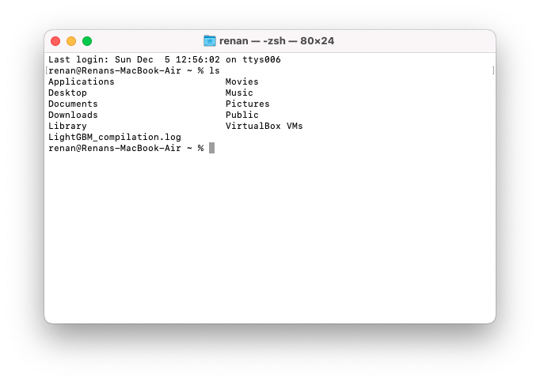
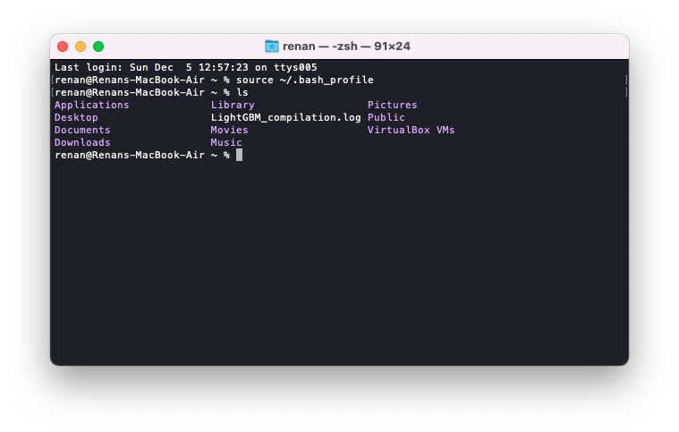
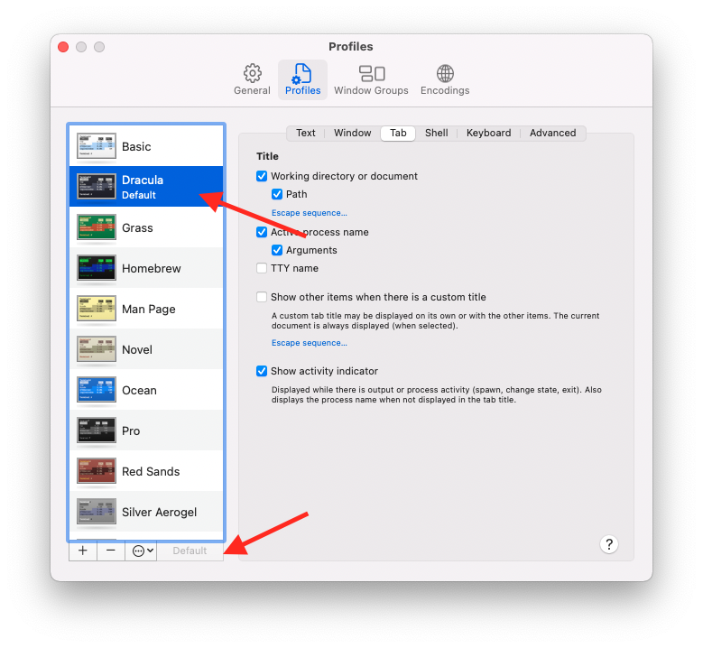
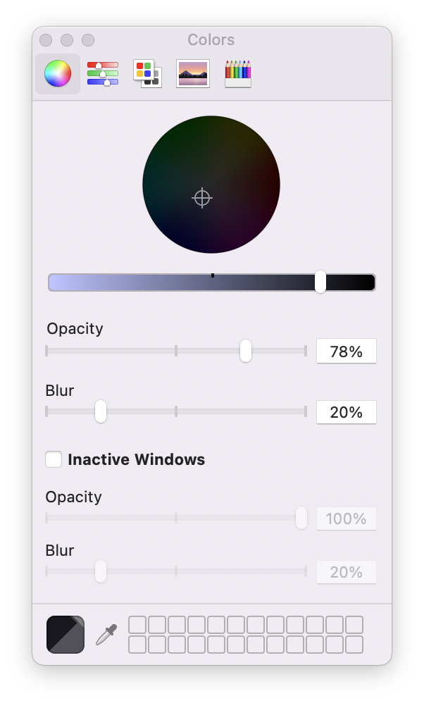
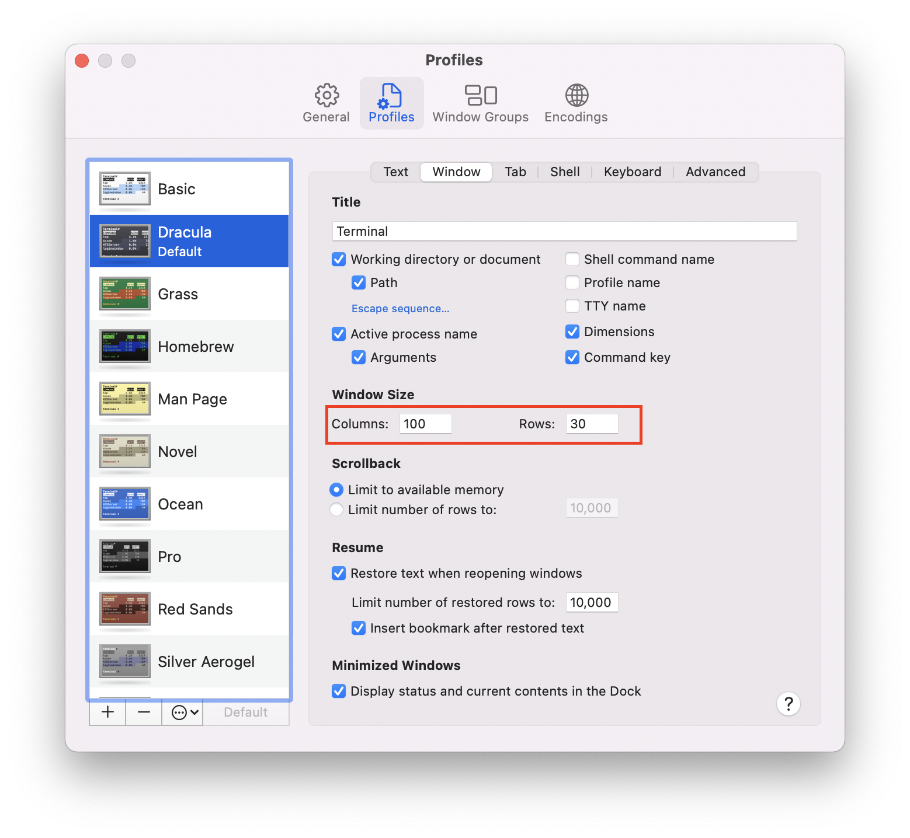
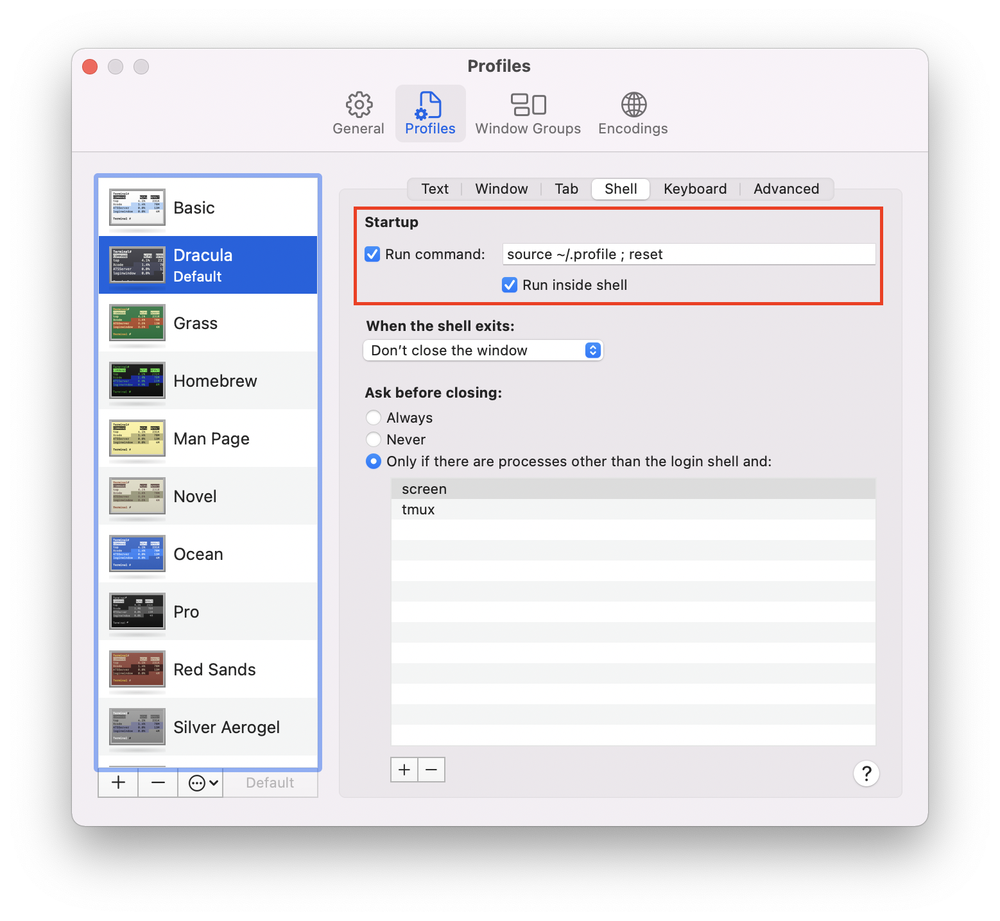

# Random Stuff

Just a collection of random stuff to make my life easier. This is part of my own GitHub repository (and one of the fews I make public), so use the content and scripts here at your own risk :)

Table of Contents
=================

<!--ts-->
* [macOS Stuff](#macOS-Stuff)
  * [Making terminal better](#making-terminal-better)
  * [Oh-My-Posh Terminal Prompt Customization](#oh-my-posh-terminal-prompt-customization)

<!--te-->
# macOS Stuff
Configuration files and scripts to make my macOS better for day-to-day activities

## Making terminal better
Instead of having the ugly and non-intuitive standard terminal screen on macOS like the one below:


Just a few changes will make it looking way better, like below:


1. Download the Dracula Terminal color scheme from this Github repository: https://github.com/lysyi3m/macos-terminal-themes
2. Open the `dracula.terminal` file and set it as default on macOS
3. 
4. Set background Opacity to 78%
5. 
6. On Window tab, set the terminal size to 100x30
7. 
8. Finally, on shell, set the Startup/Run Command to : `source ~/.profile ; reset`
9. 
10. Add the following lines to ~/.profile
```
alias ls='ls -G'
alias ll='ls -lG'
```
5. Apply the changes right away: `source ~/.bash_profile`
6. Voila!

## Oh-My-Posh Terminal Prompt Customization

If you want to take your terminal prompt to the next level, **Oh-My-Posh** is a fantastic cross-platform prompt theme engine. Here's how to set up a custom, colorful prompt with useful information at a glance.

### Installation

1. Install Oh-My-Posh via Homebrew:
```bash
brew install oh-my-posh
```

2. Add Oh-My-Posh initialization to your shell config. For zsh, add this to `~/.zshrc`:
```bash
eval "$(oh-my-posh init zsh --config ~/.config/oh-my-posh/theme.omp.json)"
```

### Custom Theme Configuration

Create `~/.config/oh-my-posh/theme.omp.json` with the following theme:

```json
{
  "$schema": "https://raw.githubusercontent.com/JanDeDobbeleer/oh-my-posh/main/themes/schema.json",
  "final_space": true,
  "console_title_template": "{{ .Shell }} ~ {{ .Folder }}",
  "blocks": [
    {
      "type": "prompt",
      "alignment": "left",
      "segments": [
        {
          "type": "session",
          "style": "diamond",
          "foreground": "#ffffff",
          "background": "#2d2d2d",
          "leading_diamond": "╭─",
          "trailing_diamond": "",
          "properties": {
            "user_color": "#a6c",
            "host_color": "#6a9"
          }
        },
        {
          "type": "path",
          "style": "powerline",
          "foreground": "#ffffff",
          "background": "#0087d7",
          "powerline_symbol": " ",
          "properties": {
            "style": "folder",
            "max_depth": 3,
            "home_symbol": "🏠"
          }
        },
        {
          "type": "git",
          "style": "powerline",
          "foreground": "#ffffff",
          "background": "#d700af",
          "powerline_symbol": " ",
          "properties": {
            "branch_icon": "🌿 ",
            "commit_icon": "📝 ",
            "fetch_status": true,
            "status_formats_init": {
              "ahead": "⇡${count}",
              "behind": "⇣${count}",
              "diverged": "⇕⇡${ahead}⇣${behind}",
              "gone": "✘",
              "untracked": "❓${count}",
              "stashed": "📦${count}",
              "modified": "✏️${count}",
              "staged": "✅${count}",
              "renamed": "✏️${count}",
              "deleted": "🗑️${count}"
            }
          }
        },
        {
          "type": "node",
          "style": "powerline",
          "foreground": "#000000",
          "background": "#6ec642",
          "powerline_symbol": " ",
          "properties": {
            "display_mode": "files",
            "file_extensions": [
              ".js",
              ".ts",
              ".jsx",
              ".tsx",
              ".vue",
              ".mjs",
              ".cjs",
              "package.json"
            ],
            "display_version": false,
            "prefix": "⬢ "
          }
        },
        {
          "type": "python",
          "style": "powerline",
          "foreground": "#000000",
          "background": "#ffd700",
          "powerline_symbol": " ",
          "properties": {
            "display_mode": "files",
            "file_extensions": [
              ".py",
              ".ipynb",
              "Pipfile",
              "pyproject.toml",
              "requirements.txt"
            ],
            "display_version": false,
            "prefix": "🐍 "
          }
        },
        {
          "type": "command",
          "style": "plain",
          "foreground": "#00ff7f",
          "properties": {
            "shell": "bash",
            "command": "echo ' '"
          }
        },
        {
          "type": "text",
          "style": "plain",
          "foreground": "#00ff7f",
          "properties": {
            "text": "❯"
          }
        }
      ]
    }
  ]
}
```

**Key Features:**
- **Session Info**: Shows username and hostname with a custom background
- **Path Display**: Current directory in blue, supports symbolic home folder (🏠)
- **Git Integration**: 
  - Branch name with 🌿 icon
  - Git status with helpful emojis (✅ for staged, ✏️ for modified, 🗑️ for deleted, etc.)
  - Fetch status showing ahead/behind remote
- **Language Indicators**: 
  - 🐍 Python badge (shows when in Python projects)
  - ⬢ Node.js badge (shows when in Node.js projects)
- **Single-line Prompt**: Clean, minimalist design with green prompt arrow (❯)

### Color Scheme

- **Session**: Dark gray background (#2d2d2d)
- **Path**: Blue background (#0087d7)
- **Git**: Magenta background (#d700af)
- **Node.js**: Green background (#6ec642)
- **Python**: Gold background (#ffd700)
- **Prompt**: Bright green foreground (#00ff7f)

### How It Works

The prompt automatically detects:
- Which Git branch you're on and the status of your repository
- If you're in a Python or Node.js project (based on file extensions)
- Your current directory path

This makes it super easy to see at a glance what project you're working on and the state of your repository without running extra commands.

### Customization Tips

To customize the theme further, edit `~/.config/oh-my-posh/theme.omp.json` and:
- Change hex colors to your preference
- Add more language indicators (Ruby, Go, Rust, etc.)
- Modify emoji icons in git status configurations
- Adjust path depth display with `"max_depth"` property

Then reload your shell: `exec zsh`

For more information, check the [Oh-My-Posh documentation](https://ohmyposh.dev).

